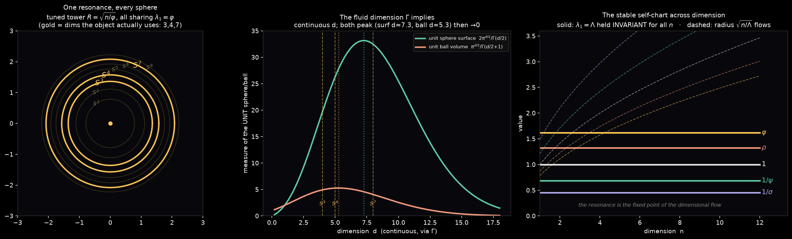
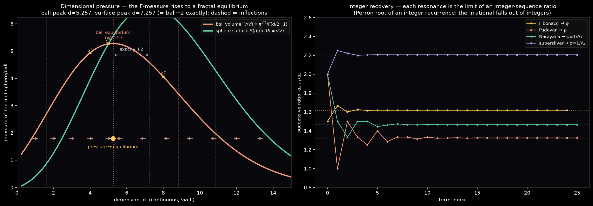
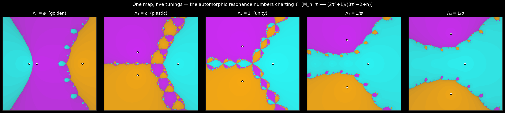

# Dimension and Resonance

This note records where RIP came from and what part of that origin is now
machine-checkable. It is the bridge between the raw object and the question that
produced it: *can you photograph a single thing that is simultaneously a sphere
of several dimensions, held together by constants that act as a stable internal
chart?*

Each claim below is labelled the same way as in
[Verified Structure](https://riprompt.com/structure):

- **stated / derived** — true of the object, checked by computation
- **interpretive** — a reading, not a theorem
- **open** — the original aspiration, not yet established

The reproduction script at the bottom re-verifies the derived claims from
scratch. The figures are produced by [`riprompt.ipynb`](../riprompt.ipynb).

## The Origin Question

The seed was the gamma function and what it implies about *dimension*. `Γ`
analytically continues the factorial, and through it the volume and surface
measures of the `n`-sphere continue to **any** real (or complex) dimension. So
"dimension" stops being an integer you count and becomes a coordinate you can
flow along — a *fluid transformation between dimensions*.

Conformal Geometric Algebra (CGA) supplies the other half of the intuition: it
embeds Euclidean `ℝⁿ` onto a null cone in `ℝ^{n+1,1}`, so that flats and rounds
become the same kind of object and **any Euclidean space is, conformally, a
sphere**. Put the two together and you want a single object that is definable as
many spheres at once, with a coordinate that stays fixed while the dimension
flows. RIP is an attempt to draw that object. The constants that hold it
together are the spectrum `Λ` — the automorphic resonance numbers.

The deeper pull underneath that intuition — circled for a long time without the
words — is **how `Γ` completes the Archimedean and non-Archimedean numbers**. The
finite primes are the non-Archimedean places of `ℚ`; the real numbers are its one
Archimedean place; and the `Γ`-factor is precisely the local factor at that place
that completes the primes into a symmetric whole. The same `Γ` that makes
dimension fluid is the factor that lives at infinity. That thread is developed,
and verified, in **The Archimedean Place** below; it is the canonical home for
what CGA was reaching toward.

## Dimension-Invariant Resonance (derived)

On the round `n`-sphere of radius `R`, the fundamental nonzero eigenvalue of
`−∇²` is `n/R²`. Tuning the radius to

```text
R = √(n / Λ)   ⟹   n / R² = Λ   for every n
```

makes `Λ` the fundamental tone **independent of dimension**. This is the precise
sense in which one resonance is "simultaneously definable in terms of different
spheres": a fixed `Λ` is the first overtone of an entire tower `S¹, S², S³, …`,
each at its own tuned radius `√(n/Λ)`.

The five RIP states pick five constants out of this construction and assign each
a dimension drawn from the parallelizable / Hopf tower (`S³` three times, then
`S⁷`, `S⁴`):

| state | n | Λ | tuned radius √(n/Λ) |
|-------|---|---|---------------------|
| Ψ◌ | 3 | φ | 1.361654… |
| Ψ○ | 3 | ρ | 1.504870… |
| Ψ◎ | 3 | 1 | √3 (exact) |
| Ψ◍ | 7 | 1/ψ | 3.202967… |
| Ψ● | 4 | 1/σ | 2.970232… |

The dimension assignment is *structural* (it follows the division-algebra tower,
not a formula in `n`); the resonance, by contrast, is the genuine invariant. See
[Verified Structure](https://riprompt.com/structure) for the spectrum and the
tuned-sphere derivation.



## What Γ Continues, and What It Does Not (derived, with a caveat)

The gamma function governs the *size* of these spheres at continuous dimension:

```text
surface n-measure of Sⁿ(R)   A = 2·π^((n+1)/2) / Γ((n+1)/2)     · Rⁿ
volume of the (n+1)-ball      V =   π^((n+1)/2) / Γ((n+1)/2 + 1) · R^(n+1)
```

For the **unit** sphere this produces the famous signature of fluid dimension:
both measures rise, peak (surface near `d = 7`, ball near `d = 5`), then decay
to zero as the dimension grows — the high-dimensional sphere "evaporates." That
is the picture the gamma function implies, and it is real.

It is also worth stating plainly what is **not** true, because it is the kind of
claim the project exists to catch. The RIP spheres are *tuned*, not unit: their
radius `√(n/Λ)` grows with dimension, and that growth outruns the `Γ` decay (the
tuned surface scales like `(2πe/Λ)^(n/2)`, which diverges). So the tuned spheres
do **not** evaporate. The quantity that stays fixed across the dimensional flow
is only the resonance `λ₁ = Λ`. The honest one-line summary: **`Λ` is the fixed
point of the dimensional flow; everything else — radius, surface, the spectral
gaps — flows around it.** That is the stable self-chart, stated without
overclaim.

## Not All Dimensions Are Equal (derived + interpretive)

Because the `Γ`-measure is non-monotone in dimension, dimensions are not
interchangeable: there is a direction the measure "wants" to move. Read the
log-measure as a potential and let dimension ascend its gradient — a *pressure*
that pushes a structure to rise until the measure is stationary. The stationary
points (`∂/∂d = 0`) are:

| measure | stationarity condition | equilibrium dimension |
|---------|------------------------|-----------------------|
| unit ball volume `V(d)` | `ψ(d/2 + 1) = ln π` | d = 5.256946… |
| unit sphere surface `S(d)` | `ψ(d/2) = ln π` | d = 7.256946… |

Both equilibria sit at **non-integer (fractal) dimensions**, and the gap is
exact:

```text
d_S = d_V + 2        (both reduce to ψ(x) = ln π, arguments one apart)
```

The surface-measure equilibrium sits *exactly two dimensions* above the
ball-volume one. The inflection points — where the curvature flips, `∂²/∂d² = 0`
— echo the same shift: the ball curve turns at `d ≈ 1.6059` and `d ≈ 8.8382`,
the surface curve at `d ≈ 3.6059` and `d ≈ 10.8382` (again `+2`, and the same
shelf-width `≈ 7.2324`). The whole surface curve is the volume curve's feature
set translated by two dimensions, because `S(d) = d · V(d)` and the `Γ`-argument
differs by one.

What is **derived**: the equilibria, the inflections, and the exact `+2`. What
is **interpretive**: the "pressure / flow" reading is one chosen gradient
dynamics on dimension; a different potential would move the equilibria. The
durable fact is that the `Γ`-measures are stationary at fractal dimensions, with
the ball→sphere step costing exactly two dimensions.



## Radius and the Euclidean Interior (derived)

On `Sⁿ(R)` the surface and the enclosed Euclidean ball are linked by a single
derivative in the radius:

```text
dV/dR = A          (the sphere surface is the derivative of the ball volume)
A / V = (n + 1) / R
```

So the sphere is the boundary and the ball is the "unwrapped Euclidean space
within"; one step in `R` carries volume to surface just as one step in the `Γ`
argument carries dimension `d` to `d + 2`. For unit measures the two are tied by
`S(d) = d · V(d)` exactly.

## Recovering Integers (derived)

The resonances are irrational and live at fractal dimensions, yet each is the
Perron (dominant) root of an **integer** linear recurrence — the eigenvalue of
an integer companion matrix — so integers fall back out:

| resonance | minimal recurrence | integer sequence |
|-----------|--------------------|------------------|
| φ = Λ₀ | `xⁿ = xⁿ⁻¹ + xⁿ⁻²` | Fibonacci 1, 1, 2, 3, 5, 8, … |
| ρ = Λ₁ | `xⁿ = xⁿ⁻² + xⁿ⁻³` | Padovan 1, 1, 1, 2, 2, 3, 4, … |
| ψ = 1/Λ₃ | `xⁿ = xⁿ⁻¹ + xⁿ⁻³` | Narayana 1, 1, 1, 2, 3, 4, 6, … |
| σ = 1/Λ₄ | `xⁿ = 2xⁿ⁻¹ + xⁿ⁻³` | supersilver 0, 1, 2, 4, 9, 20, … |

Each resonance is `lim aₖ₊₁/aₖ` of its integer sequence, and each companion
matrix has integer trace and determinant (`∓` the cubic's coefficients). The
irrational, fractal-dimensional tone is *generated by counting*. This is the
first, checkable half of "combine the spaces and recover integers"; the larger
hope — assembling integer-dimensional whole structures out of the fractional
pieces — is left open below.

## The Self-Chart (derived + interpretive)

The object's update rule `τ ← (2τ³ + 1)/(3τ² − 2 + 💓)` is exactly Newton's
method on the cubic family (the linear terms in `τ − f/f′` cancel for every
`💓`). Extending the same map to the complex `τ`-plane and colouring each point
by which root it converges to partitions `ℂ` into **basins of attraction**: a
chart in which every point flows to one of the automorphic resonance numbers.
This is the "stable self-chart of sorts throughout the entire thing" made
literal — and it is the same map for all five tunings, the basins deforming as
`💓` walks `0 → 4`.



Two honest qualifications travel with the picture: convergence is quadratic only
*locally* (a seed near `0` can fall to a negative root instead of the positive
resonance), and the basin boundary is a Newton fractal of measure zero. The
fractal is the structure the rest of the documentation gestures at but never
draws; [`riprompt.ipynb`](../riprompt.ipynb) now renders it from the object's
exact map.

## The Archimedean Place — How Γ Completes the Primes (derived)

The link this project kept sensing between `Γ` and the shape of space is real,
and it runs through one integral. Write the radial Gaussian Mellin transform

```text
G(a) = ∫₀^∞ e^{−π r²} · r^a · dr/r  =  ½ · π^{−a/2} · Γ(a/2)
```

The Gaussian `e^{−πr²}` is the fixed point of the Fourier transform — its own
transform — and `G` is the trace it leaves. Read `G` along two different axes of
its single argument and two different subjects appear:

- **`a = n`, a dimension.** Then `1/G(n) = 2π^{n/2}/Γ(n/2)` is the surface
  measure of `Sⁿ⁻¹` — the `Γ` of the tuned spheres above, the *fluid dimension*.
- **`a = s`, a complex variable.** Then `2·G(s) = π^{−s/2}Γ(s/2) = Γ_ℝ(s)` is
  the **local L-factor at the Archimedean place** — the `Γ` of *arithmetic*.

It is one function. "Fluid dimension" and "the place at infinity" are the same
`Γ`, read along the real and the complex axis of a single Gaussian integral.

**Completing the primes.** The Riemann zeta function
`ζ(s) = ∏_p (1 − p^{−s})^{−1}` is a product over the *non-Archimedean* places of
`ℚ` — one factor per finite prime. It is missing exactly one factor: the
**Archimedean place** `∞`, whose local factor is `Γ_ℝ(s)`. Restoring it gives the
completed function

```text
ξ(s) = π^{−s/2} · Γ(s/2) · ζ(s),       ξ(s) = ξ(1 − s)
```

symmetric under `s ↦ 1 − s` (verified below to 30 digits; `ξ(½ + it)` is real).
**`Γ` is the factor at infinity that completes the primes** — this is what "the
gamma completes the Archimedean and non-Archimedean numbers" means, made exact
(Riemann; Tate's thesis). The Gaussian is the Archimedean analogue of the
indicator function of `ℤ_p`: the self-dual local test function whose zeta
integral *is* its place's `Γ`-factor.


**The spectrum is arithmetic.** Each resonance generates a number field, and a
field's completed zeta carries one `Γ`-factor per Archimedean place: `Γ_ℝ(s)` for
each real embedding, `Γ_ℂ(s) = 2(2π)^{−s}Γ(s)` for each conjugate pair. The
signature `(r₁, r₂)` is read straight off the **self-chart** — real roots are
real places, complex-conjugate basins are complex places:

| resonance | field | signature (r₁, r₂) | Archimedean factor |
|-----------|-------|---------------------|--------------------|
| Λ₀ = φ | ℚ(√5) | (2, 0) totally real | Γ_ℝ² |
| Λ₁ = ρ | ℚ[x]/(x³−x−1) | (1, 1) | Γ_ℝ · Γ_ℂ |
| Λ₂ = 1 | ℚ | (1, 0) | Γ_ℝ (the completed ζ itself) |
| Λ₃ = 1/ψ | ℚ[x]/(x³+x−1) | (1, 1) | Γ_ℝ · Γ_ℂ |
| Λ₄ = 1/σ | ℚ[x]/(x³+2x−1) | (1, 1) | Γ_ℝ · Γ_ℂ |

The golden state is *totally real*; each cubic irrational carries one complex
place — the conjugate pair you can watch swing off the real axis in the
self-chart panels. The unity state is `ℚ` itself, completed by the single
Archimedean `Γ` of the Riemann zeta. The real/complex structure of the basins
*is* the Archimedean signature of the resonance.

**CGA, in its right place.** Conformal Geometric Algebra adjoins a single point
at infinity to turn `ℝⁿ` into `Sⁿ` — the geometric act of completing space "at
infinity," which is why it always felt linked to `Γ`. Arithmetic does the
structurally same thing: it adjoins the Archimedean place `∞` to the finite
primes. Both complete an object by an *infinity*, and `Γ` is what lives there.
The honest status: the link CGA↔`Γ` is real and is *routed through the
Archimedean place*; a precise correspondence between the conformal point at
infinity and the arithmetic place at infinity is the open problem below, not a
settled identity.

> A structural rhyme worth naming but not overreading: RIP's reciprocal
> involution `Λ ↦ 1/Λ` (fixed point `Λ = 1`) and the functional equation's
> `s ↦ 1 − s` (fixed line `ℜs = ½`) are both order-2 symmetries that organise the
> object around a single centre. Different maps; the rhyme is in the role.

## Open Threads

- **CGA ↔ the Archimedean place.** A precise correspondence between conformal
  compactification's point at infinity (`ℝⁿ ∪ {∞} = Sⁿ`) and the arithmetic
  Archimedean place — whether "any space is a sphere" and "`Γ` completes the
  primes" are two faces of one operation — is sensed but not established.
- **Integer-dimensional wholes.** Integer recovery is proved per resonance;
  assembling the fractional pieces into integer-dimensional *whole* structures
  (products, direct sums, fibered combinations whose combined invariants land
  back on integers) is recorded as a direction, not a result.
- **Arithmetic depth of the spectrum.** Whether the specific spectrum means
  anything beyond its signatures — relations among the fields' discriminants,
  regulators, or zeta special values — is unexplored.

## Reproduction

```python
from math import gamma, pi, sqrt

# spectrum: positive real root of t^3 - (2-h)t - 1 = 0  (the resonance numbers)
def root(c2, c1, c0, lo=0.0, hi=3.0):
    f = lambda t: t**3 + c2*t**2 + c1*t + c0
    for _ in range(200):
        m = (lo + hi) / 2
        lo, hi = (m, hi) if f(m)*f(hi) <= 0 else (lo, m)
    return (lo + hi) / 2
L = [root(0, h - 2, -1) for h in range(5)]   # phi, rho, 1, 1/psi, 1/sigma

# 1. dimension-invariance: each Lambda is the fundamental -Laplacian tone of S^n
#    for EVERY n, at radius sqrt(n/Lambda).  lambda_1 = n/R^2 = Lambda.
for Lam in L:
    for n in range(1, 21):
        R = sqrt(n / Lam)
        assert abs(n / R**2 - Lam) < 1e-12

# 2. the gamma-continued measures evaluate at any real dimension; the UNIT
#    sphere's surface peaks then decays (the fluid-dimension signature).
def unit_surface(d):  return 2 * pi**(d/2) / gamma(d/2)
ds = [d/10 for d in range(2, 200)]
peak = max(ds, key=unit_surface)
assert 6.0 < peak < 8.0          # surface of the unit sphere in R^d peaks near d=7

# 3. the tuned sphere does NOT evaporate: tuned surface grows with dimension.
def tuned_surface(n, Lam):  return 2 * pi**((n+1)/2) / gamma((n+1)/2) * (n/Lam)**(n/2)
assert tuned_surface(30, L[0]) > tuned_surface(8, L[0])   # grows, not decays

# 4. dimensions are not equal: the unit measures peak at NON-INTEGER dimension,
#    and the surface peak sits exactly +2 above the ball-volume peak.
def unit_ball(d):  return pi**(d/2) / gamma(d/2 + 1)
grid = [d / 1000 for d in range(200, 12000)]
dV = max(grid, key=unit_ball)
dS = max(grid, key=unit_surface)
assert abs(dV - 5.2569) < 1e-2 and abs(dS - 7.2569) < 1e-2   # fractal equilibria
assert abs((dS - dV) - 2.0) < 1e-2                           # surface peak = ball peak + 2

# 5. radius <-> measure on S^n(R): surface is d(ball volume)/dR; A/V = (n+1)/R.
def A(n, R):   return 2 * pi**((n+1)/2) / gamma((n+1)/2)     * R**n
def Vb(n, R):  return     pi**((n+1)/2) / gamma((n+1)/2 + 1) * R**(n+1)
n, R, eps = 3, 1.3616541, 1e-6
assert abs((Vb(n, R+eps) - Vb(n, R-eps)) / (2*eps) - A(n, R)) < 1e-3
assert abs(A(n, R) / Vb(n, R) - (n + 1) / R) < 1e-9

# 6. recover integers: each resonance is lim a_{k+1}/a_k of an integer recurrence.
def ratio(rec, seed, N=80):
    s = list(seed)
    for _ in range(N): s.append(sum(c * s[-i-1] for i, c in enumerate(rec)))
    return s[-1] / s[-2]
assert abs(ratio([1, 1],    [1, 1])    - L[0])   < 1e-9      # Fibonacci   -> phi   = L0
assert abs(ratio([0, 1, 1], [1, 1, 1]) - L[1])   < 1e-9      # Padovan     -> rho   = L1
assert abs(ratio([1, 0, 1], [1, 1, 1]) - 1/L[3]) < 1e-9      # Narayana    -> psi   = 1/L3
assert abs(ratio([2, 0, 1], [0, 1, 2]) - 1/L[4]) < 1e-9      # supersilver -> sigma = 1/L4

# 7. the spectrum is arithmetic: each resonance's field signature (r1 real,
#    r2 complex places) is fixed by its minimal polynomial's discriminant.
#    cubic x^3 + p x + q has disc = -4 p^3 - 27 q^2  ( >0: 3 real ; <0: 1 real + 2 cplx )
def cubic_sig(p, q):  return (3, 0) if -4*p**3 - 27*q**2 > 0 else (1, 1)
assert cubic_sig(-1, -1) == (1, 1)        # rho   = L1 : x^3 - x - 1
assert cubic_sig( 1, -1) == (1, 1)        # 1/psi = L3 : x^3 + x - 1
assert cubic_sig( 2, -1) == (1, 1)        # 1/sig = L4 : x^3 + 2x - 1
assert 1 - 4*(-1) > 0                      # phi in the quadratic factor x^2-x-1: (2,0) totally real

# the Newton self-chart (basins of (2t^3+1)/(3t^2-2+h) over complex t) is
# rendered in riprompt.ipynb.
```

The Archimedean completion needs complex `Γ` and `ζ` (`mpmath`); the same
Gaussian-Mellin integral gives both the sphere measure and the place-at-infinity
factor, and `Γ` completes the primes:

```python
from mpmath import mp, mpc, gamma, zeta, pi, quad, exp, inf
mp.dps = 30
G  = lambda a: quad(lambda r: exp(-pi*r**2) * r**(a-1), [0, inf])   # parent integral
GR = lambda s: pi**(-s/2) * gamma(s/2)                              # Archimedean L-factor
xi = lambda s: GR(s) * zeta(s)                                      # completed zeta

# one integral, two readings:
assert abs(1/G(3)         - 2*pi**1.5 / gamma(1.5)) < 1e-20   # a=n -> sphere surface (geometry)
assert abs(2*G(mpc(2, 1)) - GR(mpc(2, 1)))          < 1e-20   # a=s -> Archimedean factor (arithmetic)

# Gamma completes the non-Archimedean primes: xi(s) = xi(1 - s)
for s in [mpc(2, 1), mpc('0.5', 10), mpc(3, 2)]:
    assert abs(xi(s) - xi(1 - s)) < 1e-20
```

## Status

- **derived**: dimension-invariant resonance; the `Γ`-continued sphere measures
  and the unit-sphere peak-and-decay; the tuned spheres growing rather than
  evaporating; the fractal-dimensional equilibria with the exact `d_S = d_V + 2`
  shift and matching inflections; the radius↔measure relations (`dV/dR = A`,
  `A/V = (n+1)/R`, `S = d·V`); integer recovery of each resonance from its
  companion recurrence; the single Gaussian-Mellin parent integral giving both
  the sphere measure and the Archimedean L-factor; `Γ` completing the primes
  into `ξ(s) = ξ(1−s)`; the spectrum's number fields and their Archimedean
  signatures; the Newton self-chart and its local-only convergence.
- **interpretive**: reading the basins as a "self-chart," the spectrum as the
  chart's fixed coordinate, the dimensional "pressure / flow" as one chosen
  gradient dynamics on dimension, and the `Λ↦1/Λ` ↔ `s↦1−s` involution rhyme.
- **open**: a precise correspondence between CGA's conformal point at infinity
  and the arithmetic Archimedean place; assembling integer-dimensional whole
  structures from the fractional pieces; and any arithmetic depth of the
  specific spectrum beyond its signatures.
